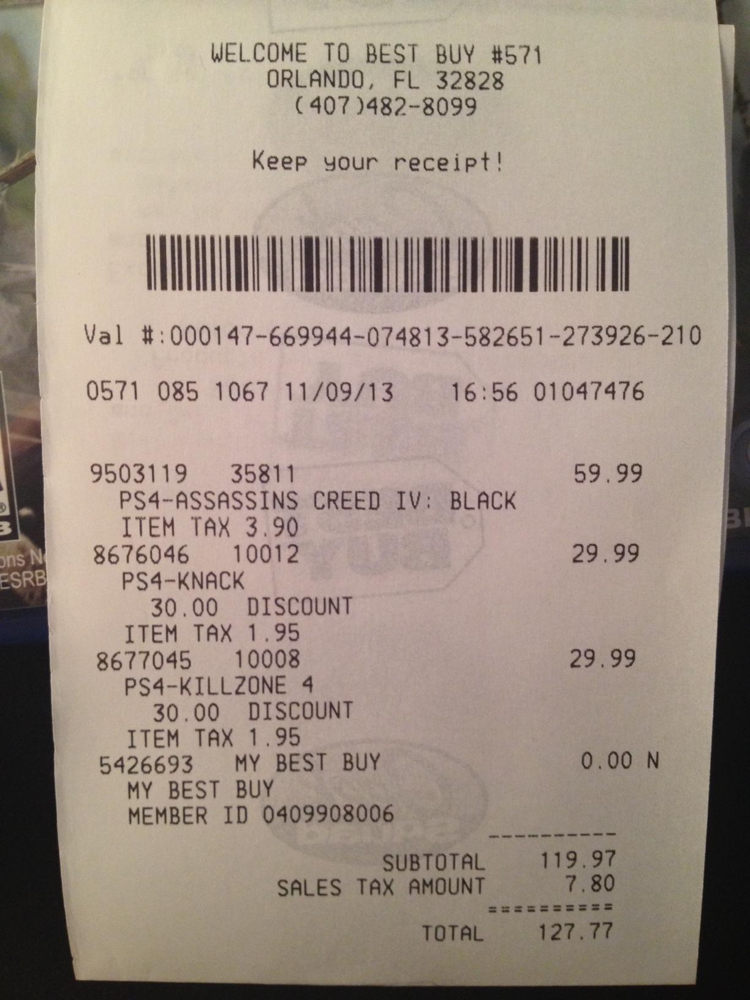

# SKFormParser
An experimental app that uses AI and the MS Semantic Kernel to perform short form parsing tasks.

## Description
This app is a proof-of-concept project that aims to demonstrate how image recognition and text completion models can be used to parse short form documents, such as invoices, receipts, or forms. *(This paragraph is generated by an AI bot)*

The app uses [Semantic Kernel (SK)](https://github.com/microsoft/semantic-kernel) as the foundation to orangize features into Skills/function and execute related tasks.

## How to run
```
dotnet build
dotnet run receipt --settings [path to a json file that contains endpoints and keys to the models] --local-image [path to an image file on your machine]
```

## Settings file format
```
// Azure OpenAI
{
  "type": "azure_openai",
  "azure_openai": {
    "deployment_label": "...deployment lable...",
    "model": "...the model name...",
    "endpoint": "...your model API endpoint...",
    "key": "...endpoint key..."
  },
  "recognizer": {
    "endpoint": "...Azure Cognitive Service Endpoint...",
    "key": "...endpoint key..."
  }
}

// OpenAI
{
  "type": "openai",
  "openai": {
    "model": "...the model name...",
    "key": "...openai endpoint key...",
    "organization": "...organization name...",
  },
  "recognizer": {
    "endpoint": "...Azure Cognitive Service Endpoint...",
    "key": "...endpoint key..."
  }
}
```

## Sample return results

```
{
  "DATE": "02/27/23",
  "LOCATION": "Seattle, 98195",
  "COMPANY": "University of Washington",
  "PHONE": "N/A",
  "ITEMS": [
    {
    "NAME": "Short-term parking tkt 1 - No. 033002",
    "PRICE": "$4.00"
    }
  ],
  "TAXES": "$1.87",
  "TOTAL": "$4.00"
}
```

```
{
        "DATE": "11/09/13",
        "LOCATION": "ORLANDO, FL 32828",
        "COMPANY": "BEST BUY #571",
        "PHONE": "( 407 )482-8099",
        "ITEMS": [
                {
                        "NAME": "PS4-ASSASSINS CREED IV: BLACK",
                        "PRICE": "59.99"
                },
                {
                        "NAME": "PS4-KNACK",
                        "PRICE": "29.99"
                },
                {
                        "NAME": "PS4-KILLZONE 4",
                        "PRICE": "29.99"
                }
        ],
        "TAXES": "7.80",
        "TOTAL": "127.77"
}
```

## Note
The parsed results are not guaranteed to be correct all the time. Further works need to be done to detect anonmaly and improve accuracy.

## Future works (just some ideas)
- Edge case testing, anonmaly detection, accuracy improvement
- Batch processing
- User interface
- Upload parse results to a database
- Use [memory](https://review.learn.microsoft.com/en-us/semantic-kernel/?branch=main) to enable querying on/chat with past results
- Email integration to automatically deteect email receipts (or other kinds of forms)
